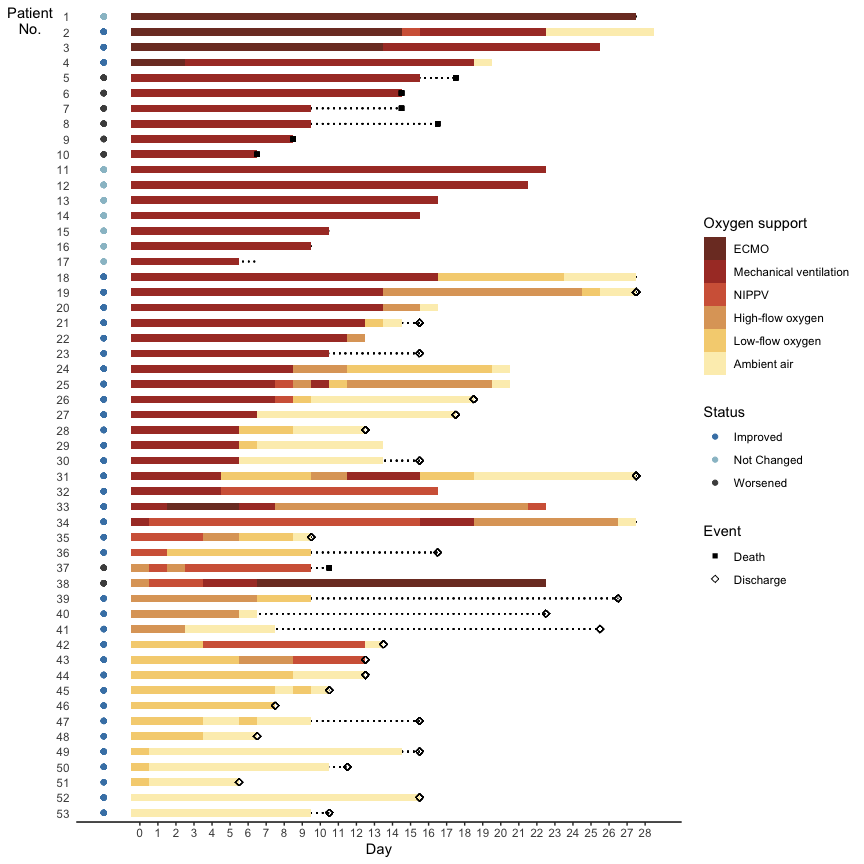

<!-- README.md is generated from README.Rmd. Please edit that file -->

# NEJM Grein Re-analysis

Lucy D’Agostino McGowan

<!-- badges: start -->

<!-- badges: end -->

This repo contains data extracted from Figure 2 from this paper
<https://www.nejm.org/doi/full/10.1056/NEJMoa2007016>

These were extracted (by hand) by me, so there may be mistakes.

## Figure 2

Below is code to recreate their Figure 2.

``` r
library(tidyverse)
d <- read_csv("data/data-fig-2.csv")
```

``` r
long_dat <- d %>%
  pivot_longer(day_1:day_36)

cats <- tibble(
  value = 1:6,
  cat = factor(c("Ambient air", "Low-flow oxygen", "High-flow oxygen", "NIPPV", 
                 "Mechanical ventilation", "ECMO"),
               levels = c("ECMO", "Mechanical ventilation", "NIPPV", 
                          "High-flow oxygen", "Low-flow oxygen", "Ambient air"))
)
long_dat %>%
  left_join(cats, by = "value") %>%
  filter(!is.na(value)) %>%
  mutate(day_oxy = as.numeric(gsub("day_", "", name)) - 1,
         day_oxy = ifelse(day_oxy > 28, 28, day_oxy),
         day = ifelse(day > 28, 28, day),
         patient = factor(patient, levels = 53:1),
         event = ifelse(event == "censor", NA, event)
  ) %>%
  ggplot(aes(x = patient, y = day_oxy, fill = cat)) +
  geom_segment(aes(x = patient, xend = patient,
                   y = 0, yend = day - 0.5), lty = 3) +
  geom_tile(width = 0.5) + 
  scale_fill_manual("Oxygen support",
                    values = c("#7D3A2C", "#AA3B2F", "#D36446", "#DEA568", 
                               "#F5D280", "#FCEEBC")) +
  geom_point(aes(x = patient, y = day - 0.5, shape = event)) +
  scale_shape_manual("Event", values = c(15, 5),
                     labels = c("Death", "Discharge", "")) +
  guides(fill = guide_legend(override.aes = list(shape = NA), order = 1)) +
  coord_flip() +
  labs(y = "day", x = "") +
  theme_classic()
```

<!-- -->

## Figure 3

The time-to-event analysis is definitely flawed. I’m trying to recreate
their flawed analysis, but have been having some trouble. Here’s what I
have so far.

I’ve created an indicator for improvement. If the final measured value
is at least 2 points lower than the first or the patient was discharged,
they were considered “clinically improved”.

``` r
long_dat <- long_dat %>%
  mutate(day_oxy = as.numeric(gsub("day_", "", name))) %>%
  filter(!is.na(value)) %>%
  group_by(patient) %>%
  mutate(first = first(value),
         last = last(value),
         improve = first >= last + 2 | event == "discharged") %>%
  ungroup()
```

To find the “time-to-improved”, I’m guessing the researchers used the
time to first improvement? That’s what I do here. This yeilds 20
patients that “improved”.

``` r
long_dat %>%
  filter(improve) %>%
  group_by(patient) %>%
  mutate(improve1 = first >= value + 2) %>%
  filter(improve1) %>%
  mutate(t = first(day_oxy),
         event = 1) %>%
  slice(1) %>%
  ungroup() %>%
  select(patient, t, event) -> events_improved
```

We also have 14 patients that didn’t “improve” by the oxygen score but
were discharged. Their “time” is time of discharge.

``` r
long_dat %>%
  filter(improve) %>%
  anti_join(events_improved, by = "patient") %>%
  group_by(patient) %>%
  mutate(t = day,
         event = 1) %>%
  slice(1) %>%
  ungroup() %>%
  select(patient, t, event) -> events_discharged
```

Then we have the non-improvers. (⚠️ big problem here is basically
treating those that died as censored. Yikes\!). Their time is the time
of death / last follow up. There are 19 in this group.

``` r
long_dat %>%
  filter(!improve) %>%
  distinct(patient, day) %>%
  mutate(event = 0) %>%
  select(patient, t = day, event) -> non_events
```

``` r
dat <- bind_rows(events_improved, events_discharged, non_events)
library(survival)
library(survminer)
ggsurvplot(survfit(Surv(time = t, event = event) ~ 1, data = dat),
           fun = "event", break.time.by = 4, ggtheme = theme_bw()) 
```

<!-- -->

My curve doesn’t look exactly like the article’s so I probably need to
do some more detective work 🕵️‍♀️.

## Notes

  - `end_rdv` the date the patient ends treatment is going to read in as
    a character value because patient 31 seems to end both on day 10 and
    day 13.
  - “Clinical improvement” is defined as a decrease of 2 points or more
    on the 6 point oxygen scale
  - Figure 3 shows the first day of clinical improvement is day 4,
    however in Figure 2 patient 36 appears to improve between days 2 and
    3 (from NIPPV to Low-flow oxygen)
